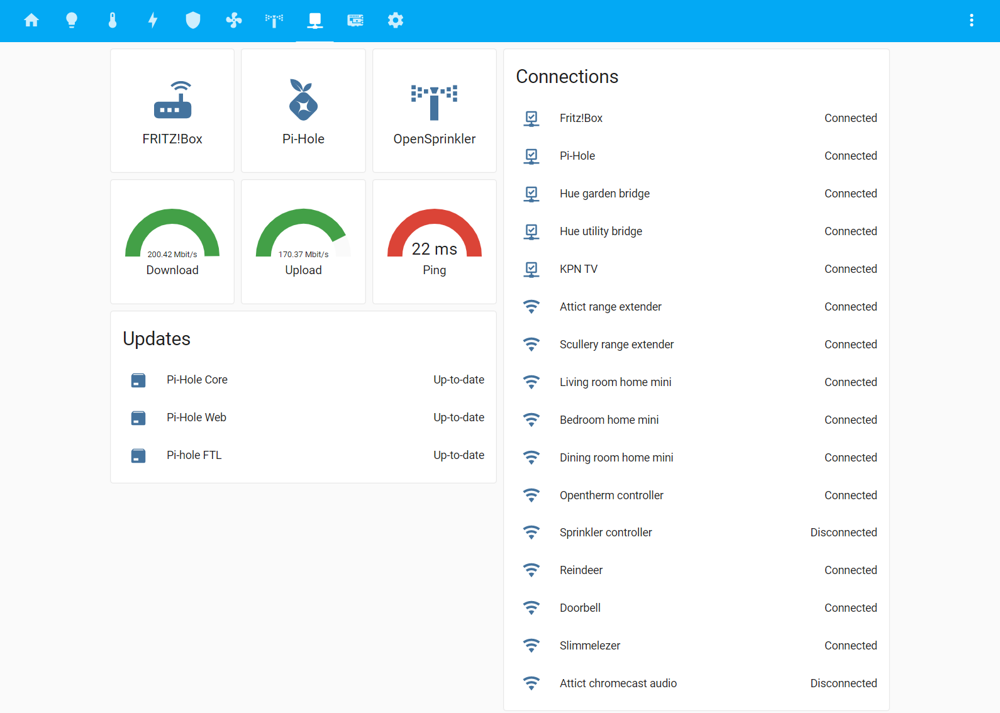
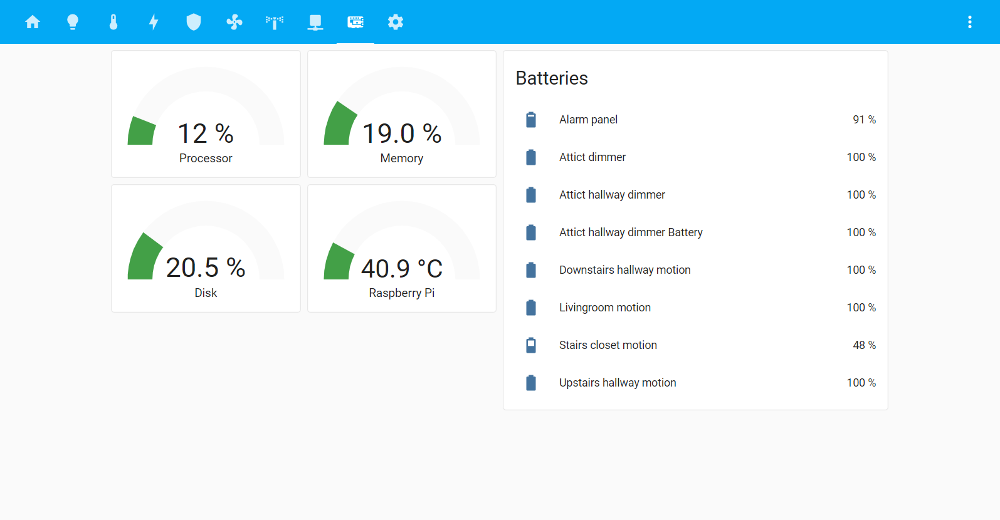

# Dashboards

Below all of my current dashboard views. Further explanation will follow.

## Home

## Lights

## Heating

## Energy

## Alarm

## Air quality

## Sprinkler

## Network

## Hardware

## Settings

